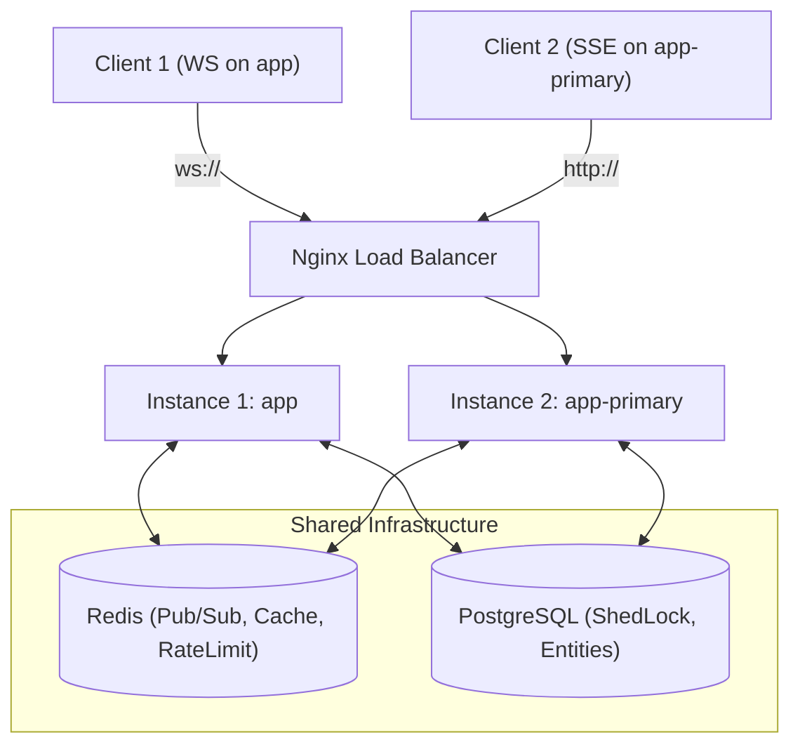

# Design Specification: Multi-Instance Cluster Coordination

- **Status:** Approved
- **Date:** 2026-06-23
- **Topic:** Multi-Instance Coordination (Scheduling, Real-Time Events, Cache, Rate Limiting)
- **Target Project:** Civilization Operating System
- **Author:** Antigravity & Pair-Programming Partner

---

## 1. Context and Problem Statement

The Civilization Operating System is deployed in a production-like multi-instance environment using Docker Compose, running two application nodes (`app` and `app-primary`) load-balanced by Nginx. While the core domain logic and tests are highly robust, the system was designed with single-instance assumptions, introducing five critical gaps in a clustered setup:

1. **Maven Wrapper Script (`mvnw`)**: Uses CRLF line endings, causing execution failure on Linux and Docker.
2. **Real-Time Event Fragmentation**: WebSockets (on `app`) and SSE (on both nodes) maintain local, in-memory connection registries. Real-time neural mesh messages are only broadcast to clients connected to the specific JVM instance where the message was processed.
3. **Concurrent Scheduling Race Conditions**: Both instances execute `@Scheduled` tasks concurrently (simulation tick every 30s and network mesh tick every 15s), causing duplicate calculations, double resource consumption, and database lock contention.
4. **Cache Inconsistency**: Caffeine is used as a local in-memory cache for resources and balance reports. Eviction (`@CacheEvict`) only clears the cache on the instance that processed the write request, leaving the other instance with stale data.
5. **Local Rate Limiting Bypass**: IP rate limits are tracked in-memory per node, allowing a client to double their limit (200 requests/minute instead of 100) if traffic is evenly load-balanced.

---

## 2. Proposed Architecture & Solution Design

We will introduce **Redis** as the shared coordination and caching layer and **ShedLock** for distributed scheduling lock management.



### 2.1. Script Compatibility (Gap 1)
Convert the `mvnw` shell script line endings from CRLF to LF using a script command during implementation.

### 2.2. Distributed Scheduling with ShedLock (Gap 3)
We will use ShedLock to ensure only one instance executes the `@Scheduled` tasks at any given time. We will back ShedLock with the existing PostgreSQL database to keep scheduling locks transactionally consistent.

* **Database Table**: A Flyway migration (`V7__add_shedlock.sql`) will create the `shedlock` table.
* **Lock Annotation**: 
  * `CortexEngineService.tick()`: Lock name `cortexEngineTick`, locked for at least 10s (to prevent quick executions on clock drift) and at most 25s.
  * `VoxtexMeshService.processMeshTick()`: Lock name `voxtexMeshTick`, locked for at least 5s and at most 12s.

### 2.3. Real-Time Event Sync via Redis Pub/Sub (Gap 2)
We will un-fragment the WebSocket and SSE connections by broadcasting all neural mesh events through a Redis channel (`voxtex-mesh-events`).

* **Publish Flow**: When a node creates or routes a message (in `VoxtexMeshService`), instead of calling in-memory listeners directly, it serializes a DTO to JSON and publishes it to the Redis channel using `RedisTemplate`.
* **Subscribe Flow**: A `RedisMessageListenerContainer` in both instances listens to `voxtex-mesh-events`. When a message is received:
  1. It triggers local SSE emitters registered on that JVM node.
  2. It triggers the local `VoxtexWebSocketHandler` to broadcast the message to its active WebSocket sessions.

### 2.4. Cache Consistency via Redis Cache (Gap 4)
We will replace the local Caffeine cache manager with a Redis-backed Spring Cache manager.

* **Cache Manager**: Configure `RedisCacheManager` with a default TTL of 5 minutes.
* **Cache Semantics**: Annotation-based caching (`@Cacheable` and `@CacheEvict`) remains unchanged. Spring will automatically serialize objects to Redis and delete the keys across the entire cluster upon eviction, ensuring immediate global consistency.

### 2.5. Centralized Rate Limiting (Gap 5)
We will implement a lightweight, distributed sliding/fixed-window rate limiter in `RateLimitingFilter.java` using Redis.

* **Algorithm**:
  1. Generate a Redis key: `rate:limit:<IP>`.
  2. Increment the key value using `StringRedisTemplate.opsForValue().increment(key)`.
  3. If the value is `1` (new window), set a TTL of 60 seconds.
  4. If the value exceeds 100, return HTTP 429 (Too Many Requests).

---

## 3. Data Flow Diagram

```
[HTTP / REST / WebSocket Requests]
            │
            ▼
   [Nginx Load Balancer]
      ├── /ws/voxtex ──────► [Instance 1: app]
      └── /api/v1/*  ──────► [Load Balanced] ──► [Instance 2: app-primary]
                                  │
                                  ▼
                        [RateLimitingFilter] ──► Query Redis (rate:limit:IP)
                                  │
                       [Cache Check (Redis)] ──► Return cached balance/resources if present
                                  │
                             [Service]
                                  │
                        [DB Write & Cache Evict] ──► Evict from Redis (Evicts for BOTH nodes)
                                  │
                       [Publish Message Event] ──► Redis Pub/Sub (voxtex-mesh-events)
                                  │
                     ┌────────────┴────────────┐
                     ▼                         ▼
             [Receive on app]         [Receive on app-primary]
                     │                         │
           [Broadcast to active]      [Broadcast to active]
           [WebSocket & SSE clients]  [SSE clients]
```

---

## 4. Implementation Checklist

1. **Infrastructure & Prep**:
   - Convert `mvnw` line endings to LF.
   - Add Redis service to `docker-compose.yml`.
   - Add Maven dependencies for Redis and ShedLock in `pom.xml`.
2. **Scheduling Locks**:
   - Create Flyway migration for `shedlock` table.
   - Configure ShedLock bean in Spring Boot.
   - Add `@SchedulerLock` annotations to scheduled methods.
3. **Event Synchronization**:
   - Create Redis Pub/Sub configuration and subscriber listener.
   - Modify `VoxtexMeshService` to publish events to Redis.
   - Connect Redis subscriber to local SSE and WebSocket handlers.
4. **Cache & Rate Limiting**:
   - Replace Caffeine Cache with Redis Cache.
   - Rewrite `RateLimitingFilter` to use Redis keys with TTLs.
5. **Validation**:
   - Run Maven tests to ensure no regressions.
   - Verify cluster deployment stability.
